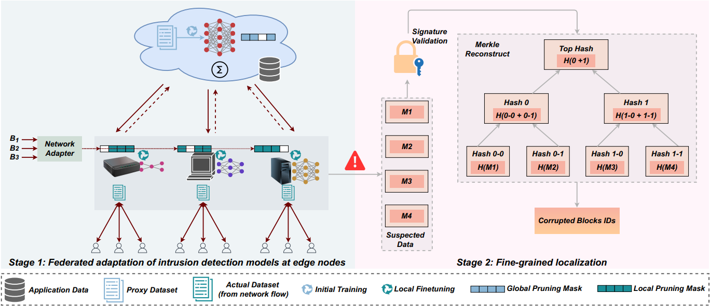

# Replication package for paper "Decoupled Edge Data Integrity via Federated Adaptation and Cryptographic Verification"


> Figure: A Conceptual Overview 

This repository provides the code and resources for the research paper **"Decoupled Edge Data Integrity via Federated Adaptation and Cryptographic Verification."** The proposed framework provides the efficient and fine-grained data integrity verification in **Mobile Edge Computing (MEC)** environments.

---

## Framework Overview  
The **D-EDIV (Decoupled Edge Data Integrity Verification)** framework introduces an efficient approach for ensuring the integrity of cached data in heterogeneous **MEC** environments. It separates the EDIV process into two stages — **corruption detection** and **corruption localization** — to improve detection accuracy and localize corrupted data with greater precision. In this framework, **intrusion detection models** operate at **edge nodes** to detect possible data corruption using **personalized federated training**, allowing adaptation to each node’s **computational capacity** and **local data distribution**. Once potential anomalies are flagged, the **Application Vendor (AV)** performs **cryptographic verification** using a **digital signature** scheme and a **Merkle tree structure** to authenticate data integrity and precisely locate corrupted blocks. **D-EDIV** achieves **efficient** and **fine-grained integrity verification** for edge-cached data while maintaining **low computational and communication costs**, without requiring an external verifier such as a Third-Party Auditor (TPA).

## Pipeline Stages

### 1. Corruption Detection
A personalized federated training approach enables the adaptation of intrusion detection models across heterogeneous edge nodes. 
- Central server initializes training with an overparameterized reference model on a proxy dataset.
- Generates a global pruning mask to identify and preserve globally important feature channels.
- Disseminates the reference model and global pruning mask to all edge nodes.

Each edge node:
- Uses a network adapter to derive a local pruning mask based on its computational capacity.
- Prunes the reference model while respecting globally important channels.
- Fine-tunes the pruned model using local data.
- Edge nodes transmit fine-tuned models back to the central server.
- Server performs channel-wise aggregation to update the global reference model.
The process iterates for several rounds until each edge node obtains an optimized intrusion detection model adapted to local conditions.

### 2. Corruption Localization
- Source dataset from a data-rich domain and target dataset from a data-scarce domain are fed to identified network to extract respective embeddings.
- Contrastive training and domain alignment are performed jointly. Specifically, the **dual-margin contrastive loss** structures the embedding space for improved discriminability, while the **Maximum Mean Discrepancy (MMD)** objective facilitates alignment between the source domain and the RF data-scarce target domain.


---

## Datasets
- For the source domain, well-established, data-rich image classification datasets such as **MNIST**, **CIFAR-10** and **CIFAR-100** are used.
- For the target domain, non-augmented **RFFI dataset** is use which consists of RF samples. **RFFI dataset** can be downloaded from https://ieee-dataport.org/open-access/lorarffidataset

---

## Dependencies
Install the required packages using:

```bash
pip install -r requirements.txt
```
This project is built with **Python ≥ 3.10** and **PyTorch 2.1.0**. Offline computations are performed on **NVIDIA A100 GPU**. Other dependencies include: `torchvision`, `einops`, `numpy`, `scikit-learn`, `scipy`, `matplotlib`, `h5py`, `thop`, `torchattacks`.

## Important: Update File Paths
In the source code, look for lines marked with:

```python
# Replace with your actual path
```
Please replace these placeholder paths with the actual paths to data or files. For example:

```python
data_path = "/path/to/data"  # Replace with your actual path
```

---

## How to run ZNAX?
### Architecture Search
Run the following script to search for the optimal Vision Transformer (ViT) configuration using zero-cost proxies:

```python 
ZC_Proxies_Ranking.py
```
This script ranks candidate architectures based on four proxy metrics such as discriminability, trainability, cohesiveness, and diversity. Update any lines marked with `# Replace with your actual path` in the script to point to the correct data location on your system.

### Pre-Training and Supervised Fine-Tuning
With the optimal configuration identified during the architecture search phase, update the ViT architecture settings in `main.py` then run:
```python
main.py
```
- Run the pre-training block in the code first. This step performs contrastive training and domain alignment, where dual-margin contrastive loss and MMD are jointly optimized to structure the embedding space—enhancing discriminability while aligning the source domain with the RF data-scarce target domain. 
- Next, run the supervised fine-tuning block in the code. This phase fine-tunes the Transformer encoder alongside a classifier on a small labeled RF dataset to perform final emitter identification. Finally, evaluate the fine-tuned model on the test dataset to assess its performance and generalization ability.

Again, make sure to replace the file path with the actual path to your test dataset in the code.

### main_audio_dataset
This script performs pretraining using the SpeechCommands audio dataset, followed by fine-tuning with RF data, transferring knowledge from the data-rich audio domain (source) to the data-scarce RF domain (target) for precise device authentication. To run:
```python
main_audio_dataset.py
```
## Additional Scripts
### Evasion_Attacks_Evaluation
This script evaluates the model's robustness against evasion attacks. The two variants, PGD (Projected Gradient Descent) and FGSM (Fast Gradient Sign Method), are used to generate adversarial examples. The model’s accuracy, confidence, and attack success rate are computed to assess its performance against these adversarial perturbations. To run:
```python
Evasion_Attacks_Evaluation.py
```
### RF_Spoofing_Adv_Examples
This script trains a conditional Generative Adversarial Network (GAN) to generate RF spoofed signals conditioned on device labels. The spoofed samples are then fed into our pretrained model to evaluate its robustness. To run:
```python
RF_Spoofing_Adv_Examples.py
```
### Correlation Coefficients
This script computes Spearman's and Kendall's correlation coefficients to evaluate how well the predicted rankings align with the true rankings. To run:
```python
Correlation Coefficients.py
```

### PreTraining_t_SNE
This script visualizes the embeddings learned during pre-training using t-SNE for dimensionality reduction. It helps in visualizing how well the learned embeddings from source and target domains are structured. To run: 
```python
PreTraining_t_SNE.py
```

### #Flops and #Param
This script calculates the FLOPs (Floating Point Operations) and parameter count for the top-ranked architectures, helping to assess their computational efficiency and resource requirements. To run:
```python
#Flops and #Param.py
```
---
## Experiment Variants
The experiments for both conventional training and cross-domain knowledge transfer can be conducted using `main.py` or `main_audio_dataset.py`. To switch between conventional training and cross-domain knowledge transfer, uncomment or modify the appropriate # lines in the code that correspond to each experimental setting. Make sure to replace the dataset paths and configurations accordingly when switching between modes.
